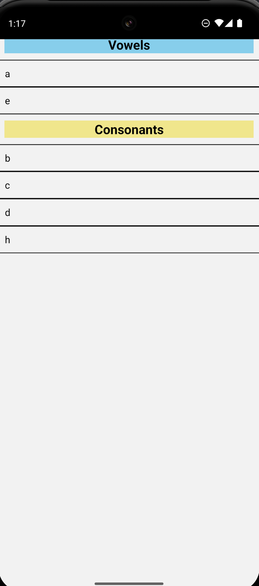

# 🌙 C346 Week07 Lesson13

[](#)
[](#)
[](#)
[](#)

---

## 📝 Overview

Lessons 13 & 14 taught us on the use of AsyncStorage.

> ✨ _Example:_ Implemented a persistent storage via the use AsyncStorage.

---

## 🎬 Demo / Media

<p align="center">
  
</p>

---

## 🚀 Features

- ✅ AsyncStorage.getItem
- ✅ AsyncStorage.setItem

---

## 💡 Key Concepts

| Concept                  | Description                      |
| :----------------------- | :------------------------------- |
| **AsyncStorage.getItem** | Fetches data from Async Storage. |
| **AsyncStorage.setItem** | Stores item into Async Storage.  |

---

## 🧱 Code Snippet

```jsx
const getData = async () => {
  let datastr = await AsyncStorage.getItem("alphadata");
  if (datastr != null) {
    const jsondata = JSON.parse(datastr);
    setMydata(jsondata);
  } else {
    setMydata(datasource);
  }
};
getData();
```
